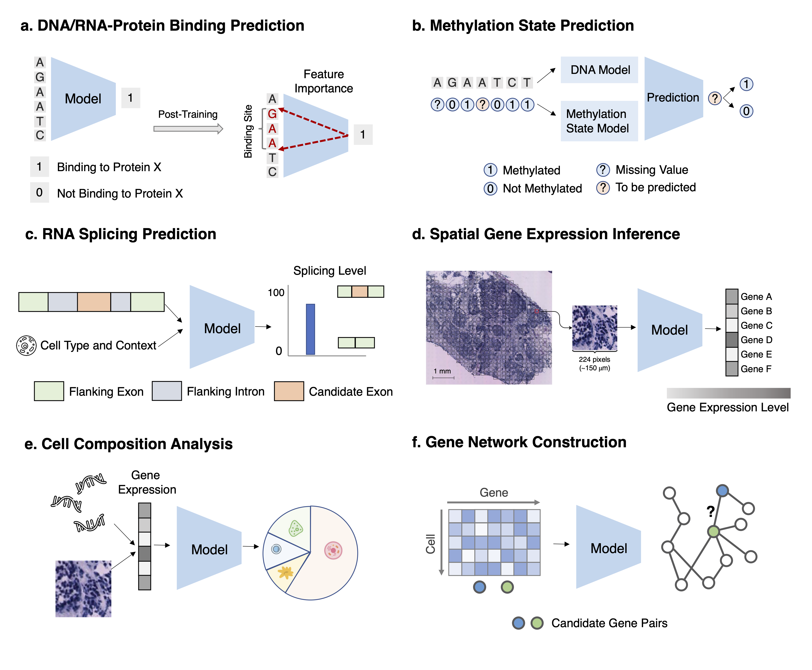
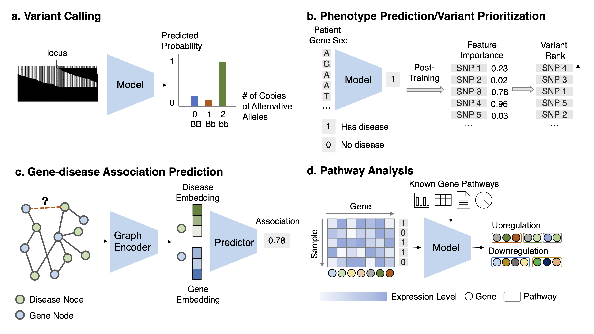
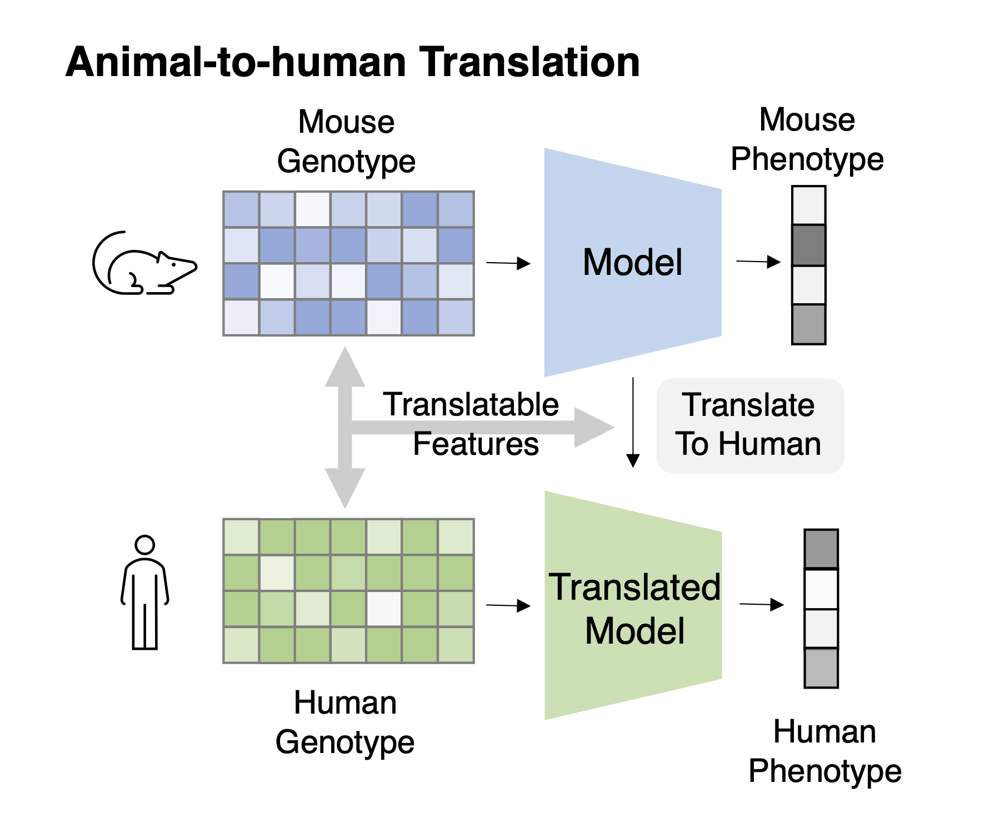
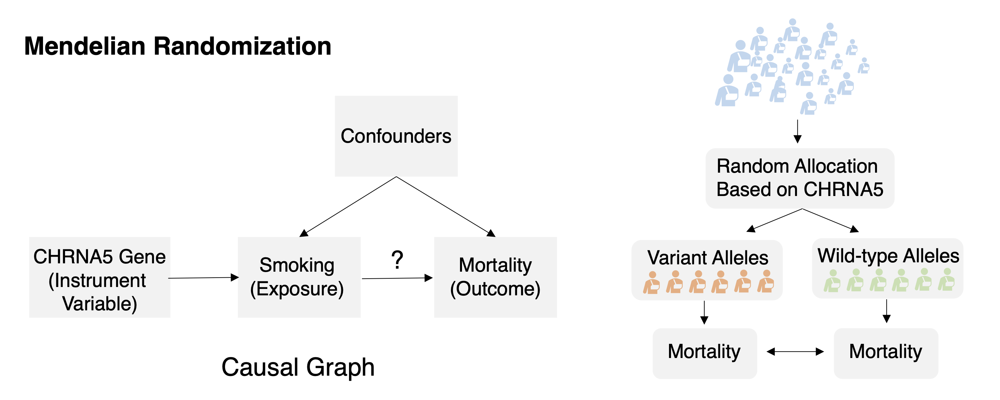

# Machine Learning for Genomics and Therapeutics Resources

This repo accompanies our survey paper: 

[Machine Learning Applications for Therapeutic Tasks with Genomics Data](https://arxiv.org/abs/2105.01171).
*Kexin Huang, Cao Xiao, Lucas M. Glass, Cathy W. Critchlow, Greg Gibson, Jimeng Sun*

We list tools, algorithms, data for this area. Feel free to make a pull request for new resources.

---- 

## Machine Learning for Genomics in Target Discovery

### Theme 1: Facilitating Understanding of Human Biology

#### Task 1: DNA-protein and RNA-protein binding prediction

**Task Description** Given a set of DNA/RNA sequences predict their binding scores. After training,use feature importance attribution methods to identify the motifs. 

**Papers**

[Jian Zhou and Olga G Troyanskaya. Predicting effects of noncoding variants with deep learning–based
sequence model. Nature Methods, 12(10):931–934, 2015.](https://pubmed.ncbi.nlm.nih.gov/26301843/)

[Babak Alipanahi, Andrew Delong, Matthew T Weirauch, and Brendan J Frey. Predicting the sequence specificities of dna-and rna-binding proteins by deep learning. Nature Biotechnology, 33(8):831–838, 2015.](https://www.nature.com/articles/nbt.3300)

[Martin Kircher, Daniela M Witten, Preti Jain, Brian J O’Roak, Gregory M Cooper, and Jay Shendure. A
general framework for estimating the relative pathogenicity of human genetic variants. Nature Genetics,
46(3):310–315, 2014.](https://pubmed.ncbi.nlm.nih.gov/24487276/)

[David R Kelley, Jasper Snoek, and John L Rinn. Basset: learning the regulatory code of the accessible
genome with deep convolutional neural networks. Genome Research, 26(7):990–999, 2016.](https://pubmed.ncbi.nlm.nih.gov/27197224/)

[Qinhu Zhang, Lin Zhu, and De-Shuang Huang. High-order convolutional neural network architecture
for predicting dna-protein binding sites. IEEE/ACM transactions on Computational Biology and
Bioinformatics, 16(4):1184–1192, 2018.](https://ieeexplore.ieee.org/document/8325519)

[Zhen Cao and Shihua Zhang. Simple tricks of convolutional neural network architectures improve
dna–protein binding prediction. Bioinformatics, 35(11):1837–1843, 2019.](https://pubmed.ncbi.nlm.nih.gov/30351403/)

**Datasets**

[Zeng et al.](http://cnn.csail.mit.edu/)

#### Task 2: Methylation state prediction

**Task Description** For a DNA/RNA position with missing methylation status, given its availableneighboring methylation states and the DNA/RNA sequence, predict the methylation status on the positionof interest. 

**Papers**

[Keith D Robertson. Dna methylation and human disease. Nature Reviews Genetics, 6(8):597–610, 2005.](https://pubmed.ncbi.nlm.nih.gov/16136652/)

[Weiwei Zhang, Tim D Spector, Panos Deloukas, Jordana T Bell, and Barbara E Engelhardt. Predicting genome-wide dna methylation using methylation marks, genomic position, and dna regulatory elements. Genome Biology, 16(1):1–20, 2015.](https://genomebiology.biomedcentral.com/articles/10.1186/s13059-015-0581-9)

[John W Whitaker, Zhao Chen, and Wei Wang. Predicting the human epigenome from dna motifs.
Nature Methods, 12(3):265, 2015.](https://pubmed.ncbi.nlm.nih.gov/25240437/)

[Chantriolnt-Andreas Kapourani and Guido Sanguinetti. Melissa: Bayesian clustering and imputation of
single-cell methylomes. Genome Biology, 20(1):1–15, 2019.](https://genomebiology.biomedcentral.com/articles/10.1186/s13059-019-1665-8)

[Joshua J Levy, Alexander J Titus, Curtis L Petersen, Youdinghuan Chen, Lucas A Salas, and Brock C
Christensen. Methylnet: an automated and modular deep learning approach for dna methylation
analysis. BMC Bioinformatics, 21(1):1–15, 2020.](https://bmcbioinformatics.biomedcentral.com/articles/10.1186/s12859-020-3443-8)

[Quan Zou, Pengwei Xing, Leyi Wei, and Bin Liu. Gene2vec: gene subsequence embedding for
prediction of mammalian n6-methyladenosine sites from mrna. RNA, 25(2):205–218, 2019](https://pubmed.ncbi.nlm.nih.gov/30425123/)

#### Task 3: RNA splicing prediction

**Task Description** Given an RNA sequence and its cell type, if available, for each nucleotide,predicts the probability of being a spliced breakpoint and the splicing level. 

[Núria López-Bigas, Benjamin Audit, Christos Ouzounis, Genís Parra, and Roderic Guigó. Are splicing mutations the most frequent cause of hereditary disease? FEBS Letters, 579(9):1900–1903, 2005.](https://pubmed.ncbi.nlm.nih.gov/15792793/)

[Sahar Gelfman, Quanli Wang, K Melodi McSweeney, Zhong Ren, Francesca La Carpia, Matt Halvorsen, Kelly Schoch, Fanni Ratzon, Erin L Heinzen, Michael J Boland, et al. Annotating pathogenic non-coding variants in genic regions. Nature Communications, 8(1):1–11, 2017.](https://pubmed.ncbi.nlm.nih.gov/28794409/)

[Joseph M Paggi and Gill Bejerano. A sequence-based, deep learning model accurately predicts rna splicing branchpoints. RNA, 24(12):1647–1658, 2018.](https://pubmed.ncbi.nlm.nih.gov/30224349/)

[Karthik A Jagadeesh, Joseph M Paggi, S Ye James, Peter D Stenson, David N Cooper, Jonathan A Bernstein, and Gill Bejerano. S-cap extends pathogenicity prediction to genetic variants that affect rna splicing. Nature Genetics, 51(4):755–763, 2019.](https://pubmed.ncbi.nlm.nih.gov/30804562/)

#### Task 4: Spatial gene expression inference

**Task Description** Given the histopathology image of the tissue, predict the gene expression forevery gene at each spatial transcriptomics spot.

[Patrik L Ståhl, Fredrik Salmén, Sanja Vickovic, Anna Lundmark, José Fernández Navarro, Jens Magnusson, Stefania Giacomello, Michaela Asp, Jakub O Westholm, Mikael Huss, et al. Visualization and analysis of gene expression in tissue sections by spatial transcriptomics. Science, 353(6294):78–82, 2016.](https://pubmed.ncbi.nlm.nih.gov/27365449/)

[Alona Levy-Jurgenson, Xavier Tekpli, Vessela N Kristensen, and Zohar Yakhini. Spatial transcriptomics
inferred from pathology whole-slide images links tumor heterogeneity to survival in breast and lung
cancer. Scientific Reports, 10(1):1–11, 2020.](https://www.nature.com/articles/s41598-020-75708-z)

#### Task 5: Cell composition analysis

**Task Description** Given the gene expressions of a set of cells (in bulk RNA-seq or a spot in spatialtranscriptomics), infer proportion estimates of each cell type for this set.

[Mikala Egeblad, Elizabeth S Nakasone, and Zena Werb. Tumors as organs: complex tissues that
interface with the entire organism. Developmental Cell, 18(6):884–901, 2010.](https://pubmed.ncbi.nlm.nih.gov/20627072/)

[Francisco Avila Cobos, Jo Vandesompele, Pieter Mestdagh, and Katleen De Preter. Computational
deconvolution of transcriptomics data from mixed cell populations. Bioinformatics, 34(11):1969–1979, 2018.](https://pubmed.ncbi.nlm.nih.gov/29351586/)

[Aaron M Newman, Chih Long Liu, Michael R Green, Andrew J Gentles, Weiguo Feng, Yue Xu,
Chuong D Hoang, Maximilian Diehn, and Ash A Alizadeh. Robust enumeration of cell subsets from
tissue expression profiles. Nature Methods, 12(5):453–457, 2015.](https://www.ncbi.nlm.nih.gov/pmc/articles/PMC4739640/)

[Kevin Menden, Mohamed Marouf, Sergio Oller, Anupriya Dalmia, Daniel Sumner Magruder, Karin
Kloiber, Peter Heutink, and Stefan Bonn. Deep learning–based cell composition analysis from tissue
expression profiles. Science Advances, 6(30):eaba2619, 2020.](https://advances.sciencemag.org/content/6/30/eaba2619/tab-article-info)

[Alma Andersson, Joseph Bergenstråhle, Michaela Asp, Ludvig Bergenstråhle, Aleksandra Jurek,
José Fernández Navarro, and Joakim Lundeberg. Single-cell and spatial transcriptomics enables
probabilistic inference of cell type topography. Communications Biology, 3(1):1–8, 2020.](https://www.nature.com/articles/s42003-020-01247-y)

[Jing Su and Qianqian Song. Dstg: Deconvoluting spatial transcriptomics data through graph-based
artificial intelligence. Briefings in Bioinformatics, 2020.](https://www.nature.com/articles/s42003-020-01247-y)

#### Task 6: Gene network construction

**Task Description** Given a set of gene expression profiles of a gene set, identify the gene regulatorynetwork by predicting all pairs of interacting genes. 

90-92

### Theme 2: Identifying Druggable Biomarkers

#### Task 1: Variant calling

**Task Description** Given the aligned sequencing data ((1) read pileup image, which is a matrix ofdimension M and N, with M the number of reads and N the length of reads; or (2) the raw reads, which are aset of sequences strings) for each locus, classify the multi-class variant status.

94-98

#### Task 2: Variant pathogenicity prioritization

**Task Description** Given features about a variant, predict its corresponding disease risk and thenrank all variants based on the disease risk. Alternatively, given the DNA sequence or other related genomicsfeatures, predict the likelihood of disease risk for this sequence and retrieve the variant in the sequence thatcontributes highly to the risk prediction. 

99-104

#### Task 3: Rare disease detection
**Task Description** Given the gene expression data and other auxiliary data of a patient predictwhether this patient has a rare disease. Also, identify genetic variants for this rare disease

105-108

#### Task 4: Gene-disease association prediction
**Task Description** Given the known gene-disease association network and auxiliary information,predict the association likelihood for every unknown gene-disease pair.

109-114

#### Task 5: Pathway analysis and prediction
**Task Description** Given the gene expression data for a phenotype and known gene relations, identify a set of genes corresponding to disease pathways.

115-121

## Machine Learning for Genomics in Therapeutics Discovery

### Theme 1: Improving Context-specific Drug Response

#### Task 1: Drug Response Prediction
**Task Description** Given a pair of drug compound molecular structure and gene expression profile of the cell line, predict the drug response in this context

123-130

#### Task 2: Drug Combination Therapy Prediction

**Task Description** Given a combination of drug compound structures and a cell line’s genomics profile, predict the combination response.

131-136

### Theme 2: Improving Efficacy and Delivery of Gene Therapy

#### Task 1: CRISPR on-target outcome prediction

**Task Description** With a fixed target, given the gRNA sequence and other auxiliary information such as target gene expression and epigenetic profile, predict its on-target repair outcome.

137-144

#### Task 2: CRISPR off-target prediction
**Task Description** Given the gRNA sequence and the off-target DNA sequence, predict its off-target effect.

145-152

#### Task 3: Virus vector design
**Task Description** Given a set of virus sequences and their labels for a property X, obtain an accurate predictor oracle and conduct various generation modeling to generate de novo virus variants with a high score in X and high diversity.

153-155

## Machine Learning for Genomics in Clinical Study
**Task Description** 

### Theme 1: Translating Preclinical Animal Models to Humans

#### Task 1: Cross-species genotype-phenotype translation
**Task Description** : Given genotype-phenotype data of animals and only the genotype data of humans, train the model to fit phenotype from the genotype and transfer this model to human. 

157-162

### Theme 2: Curating High-quality Cohort

#### Task 1: Patient stratification/disease sub-typing
**Task Description** Given the gene expression and other auxiliary information for a set of patients produce criteria for patient stratification.

165-173

#### Task 2: Matching patients for genome-driven trials
**Task Description** Given a pair of patient data (genomics, EHR, etc.) and trial eligibility criteria (text description), predict the matching likelihood.

174-179

### Theme 3: Inferring Causal Effects

#### Task 1: Mendelian randomization
**Task Description** Given observation data of the genomic factor, exposure, outcome, and other auxiliary information formulate or identify the causal relations among them and compute the effect of the exposure to the outcome.

180-184

## Machine Learning for Genomics in Post-Market Study
### Theme 1: Mining Real-World Evidence

#### Task 1: Mining genomics-related markers from clinical free texts
**Task Description**  Given a clinical note document, predict the genomic biomarker variable of interest.

185-189

#### Task 2: Discovering drug-gene/disease-gene interactions from scientific literature
**Task Description** Given a document from literature, extract the drug-gene, drug-disease terms, and predict the interaction types from the text.

190-199
